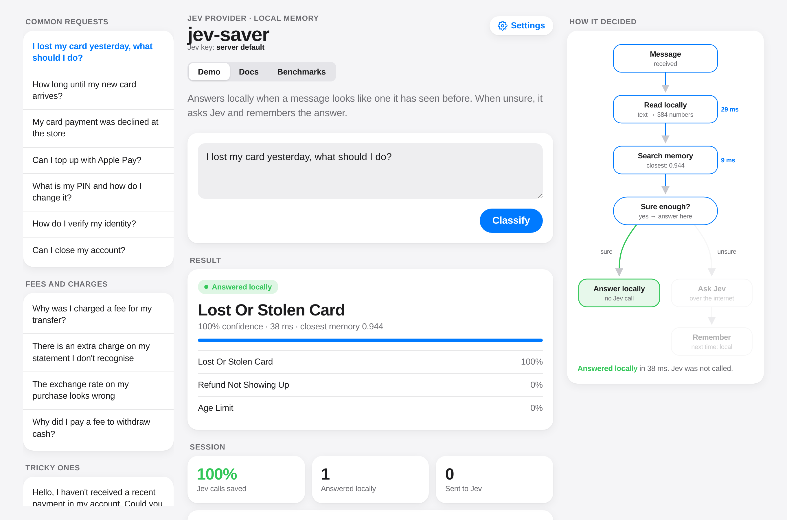
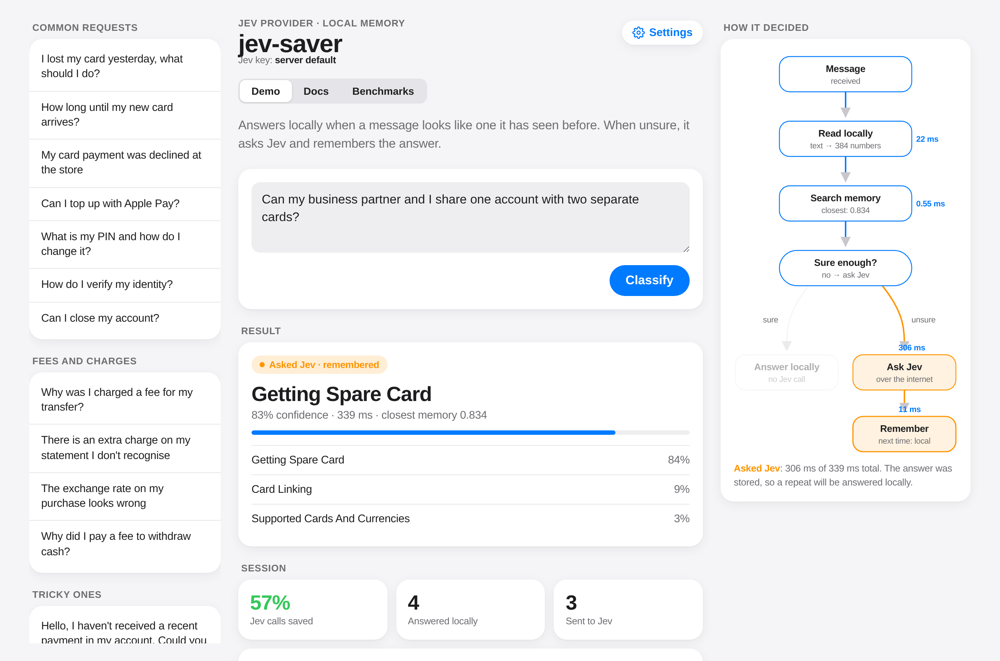
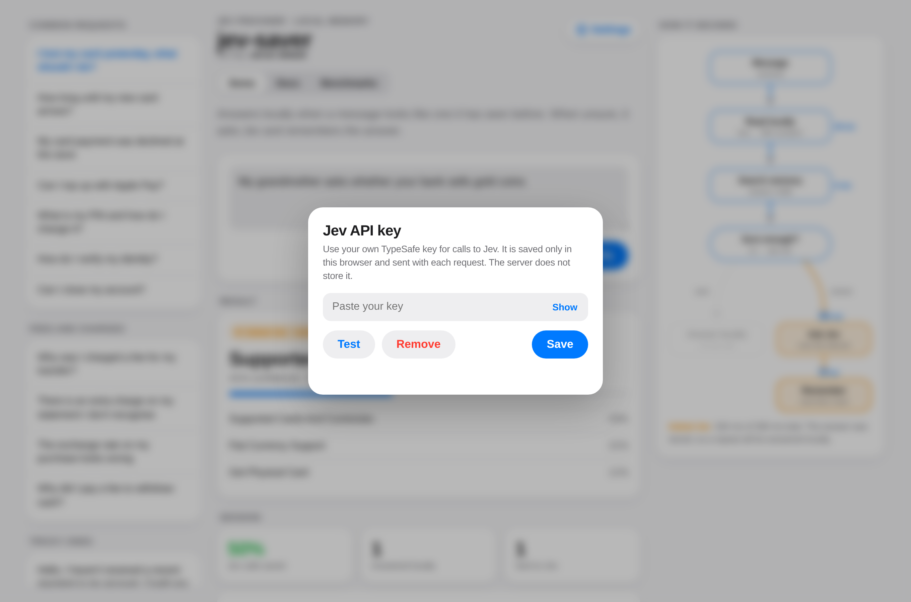
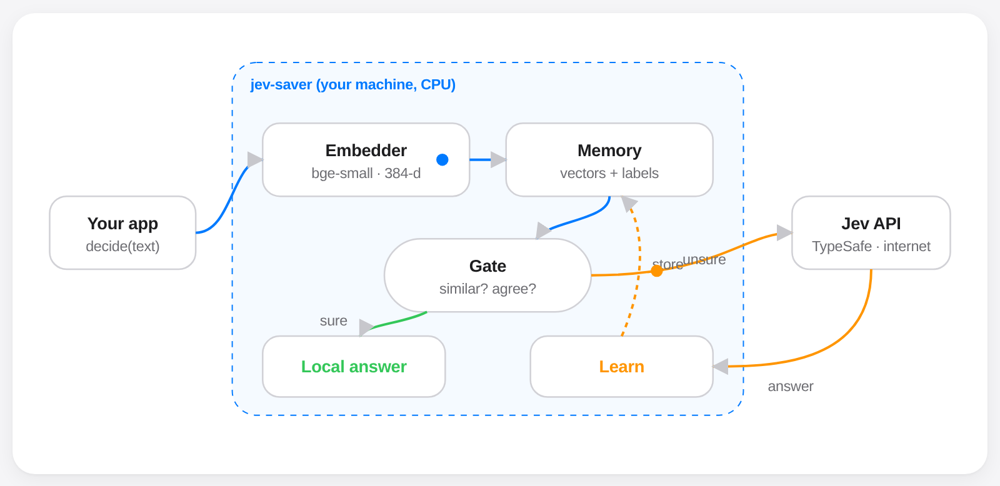
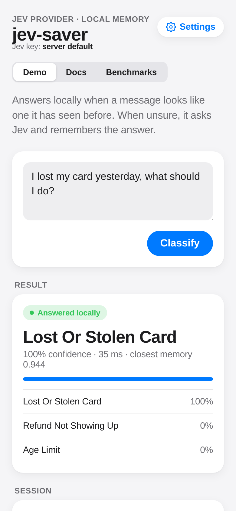
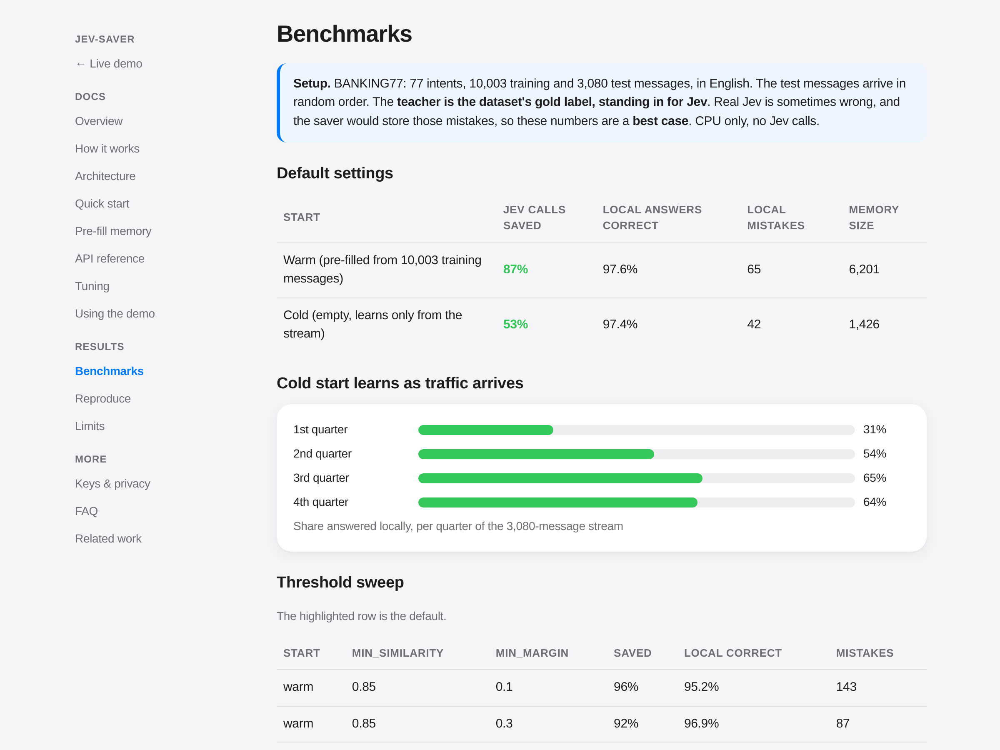

# jev-saver

**Live demo:** https://g-connect.space/jev-saver/ · **Docs:** https://g-connect.space/jev-saver/docs.html



A small local memory layer in front of [TypeSafe Jev](https://typesafe.ai) for repeated **Choice** decisions.

- If a new input looks like inputs it has already seen, and those inputs agree, it **answers locally**. No Jev call is made.
- Otherwise it **asks Jev**, returns Jev's answer, and **stores it**, so the same or a very similar input is answered locally next time.

It runs on CPU and keeps a small, saveable memory file.

> **What this is, honestly:** semantic caching plus nearest-neighbour voting. It does **not** understand anything new. It only re-uses answers for inputs that look like inputs it has already seen. A rephrasing with different words often still goes to Jev. If your traffic rarely repeats, it will save little.

## Screenshots

**Answered locally.** The message looked like ones already in memory, so Jev was not called (35 ms).


**Asked Jev, then remembered.** The memory was unsure (closest similarity 0.83), so it asked Jev (306 ms) and stored the answer. A repeat is answered locally.



**Bring your own key.** The key is kept in the browser only, and the server does not store it.



<table><tr>
<td width="62%"><b>Architecture</b><br></td>
<td width="38%"><b>Mobile</b><br></td>
</tr></table>

**Benchmarks page**



## Why

Jev is already cheap (about $0.042 per 1M input tokens). For most people, money is **not** the main reason to use this. The main reasons are:

- **Latency:** in our runs, a local answer took about 15–60 ms on CPU, compared with roughly 250–400 ms for a Jev round trip.
- **Rate limits:** fewer requests count toward Jev's per-minute limits.
- **Offline / privacy:** repeated inputs never leave the machine.

## Install

```bash
pip install git+https://github.com/ghraibeh/jev-saver
export TYPESAFE_API_KEY=...
```

## Use

```python
from jev_saver import JevSaver

saver = JevSaver(
    labels={"billing": "Payment issues", "technical": "Bugs or errors", "account": "Login or profile"},
    instructions="Which team should handle this ticket?",
    model="jev-1.13.0",          # pin the version so stored answers stay consistent
)

d = saver.decide("I was charged twice this month")
print(d.source, d.choice, d.confidence)   # "jev" the first time, "local" for repeats

saver.warm_start(texts, labels)  # optional: pre-fill from labelled data you already have
saver.save("memory.npz")         # reuse later: saver.load("memory.npz")
```

### Pre-fill memory (warm start)

If you already have labelled examples, load them before going live. No Jev calls are made. In the benchmark below, pre-filling raised calls saved from 53% to 87%.

```python
import csv
rows = [r for r in csv.DictReader(open("tickets.csv")) if r["label"] in saver.labels]   # columns: text, label
saver.warm_start([r["text"] for r in rows], [r["label"] for r in rows])
saver.save("memory.npz")                       # once
saver = JevSaver(labels, instructions).load("memory.npz")   # in production
```

Sources you can use: tickets your team already tagged, logged Jev answers (keep only high-confidence ones), or a public dataset. You can also run `decide()` over a sample of real messages once with `min_jev_confidence=0.9`. Every label must exactly match a key in `labels`. Wrong labels get pre-filled too, so use only labels you trust.

Main knobs:

- `min_similarity`: how close a stored input must be before the saver answers locally.
- `min_margin`: how clearly the local vote must win.
- `exact_similarity`: above this, the closest stored input is treated as the same input.
- `min_jev_confidence`: do not store Jev answers that are below this confidence.

You can also pass a per-call key with `decide(text, api_key=...)`, for example a key supplied by your end user. It is not stored.

Each `Decision` includes `timings` (in ms) for embed, search, jev and learn, plus `learned`.

## Benchmark (offline, reproducible)

Run `python benchmarks/banking77.py`. It uses BANKING77 (77 intents) and needs no key.

**The teacher in this benchmark is the dataset's gold label, standing in for Jev.** That makes it a **best case**: real Jev is sometimes wrong, and the saver would store those mistakes. A live run against Jev has **not** been done yet.

Setup: 3,080 test messages in random order. The saver answers locally when it is sure; otherwise it asks the teacher and learns the answer. Default settings.

| setup | teacher calls saved | local answers correct | local mistakes |
|---|---|---|---|
| warm start (memory pre-filled from 10,003 training messages) | **87%** | **97.6%** | 65 |
| cold start (empty memory, learns only from the stream) | **53%** | **97.4%** | 42 |

Cold start, by quarter of the stream: 31% → 54% → 65% → 64% answered locally.

### Threshold sweep

Run it with `python benchmarks/sweep.py`.

| start | min_similarity | min_margin | saved | local correct | mistakes |
|---|---|---|---|---|---|
| warm | 0.85 | 0.3 | 92% | 96.9% | 87 |
| warm | **0.90** | **0.3** (default) | **87%** | **97.6%** | **65** |
| warm | 0.94 | 0.6 | 64% | 98.9% | 22 |
| cold | 0.85 | 0.3 | 68% | 95.3% | 99 |
| cold | **0.90** | **0.3** (default) | **53%** | **97.4%** | **42** |
| cold | 0.94 | 0.6 | 30% | 98.1% | 17 |

Raising either threshold means fewer local answers and fewer mistakes. Lowering them means more saving and more confident mistakes.

## Limits we measured

- **No generalisation.** In a separate test, the teacher labelled 548 new messages. Accuracy on *other* unseen messages stayed at 93.7%, the same as before. The saver remembers; it does not learn the concept.
- **Wrong but sure.** About 2–3% of local answers are confidently wrong, and those are never sent to Jev.
- **English embedder.** The default `bge-small-en-v1.5` is weak on other languages. Swap the `embedder=` for a multilingual model if you need one.
- **Shifting answers.** Stored answers are tied to the Jev version and to your labels. Clear the memory when either changes.

## Related work

- [Jevstiller](https://github.com/tomerglick57/Jevstiller): the closest project. It trains a small head on frozen bge-small embeddings from Jev's recorded answers, and answers locally under a measured disagreement bound. jev-saver is simpler: there is no training step, just a nearest-neighbour vote with thresholds. It also has no statistical guarantee.
- [stuntd](https://github.com/bladedevoff/stuntd): a local proxy that learns from Jev and falls back to it.
- [decision-gate](https://github.com/zachlandes/decision-gate): handles Jev rate limits, with an optional answer cache.

- [GPTCache](https://github.com/zilliztech/GPTCache): semantic cache for LLMs.
- [jevcache](https://github.com/hyperspaceai/jevcache): exact-match cache for Jev decisions.
- FrugalGPT, [arXiv:2305.05176](https://arxiv.org/abs/2305.05176): cascades that defer to a larger model only when needed.

## License

MIT
